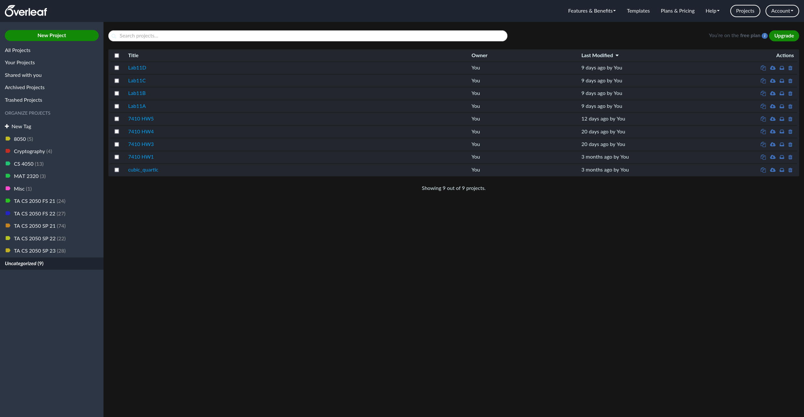
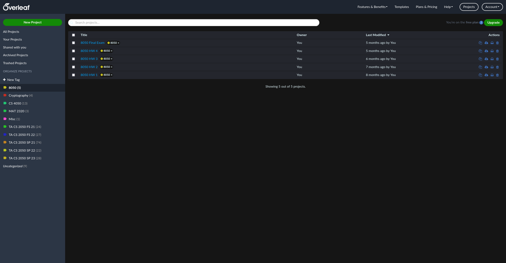
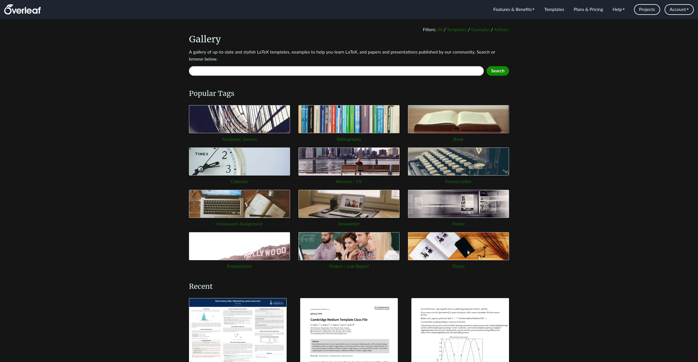

# Overleaf Dark Mode

This userstyle attempts to keep the general aesthetic of the default Overleaf theme, while offering a sleek and accessible dark mode experience.

Adapted from Dark Overleaf by Piet Piepmatz.

## Notable Exceptions

* The revision history panel hasn't been touched. I don't use it, and so it was not a priority to theme it.

* The log output hasn't been touched. It was not a priority for me.

* I do not have an Overleaf subscription, and so there are certain parts of the site which I have not visited. I have not verified the efficacy of this theme on every page, as I focused mostly on the project page and the home page.

If you find a spot where this theme lacks coverage, it would be greatly appreciated if you would open an issue to note this, and provide screenshots of the issue. Additionally, PRs with fixes applied are welcomed!

## Accessibility

Keeping in mind that this is a *dark mode* theme, I have made a best effort to maintain a good level of contrast when selecting colors. However, if there are color combinations in my palette which make it diffucult for you to use this theme, please open an issue with screenshot examples and I'd be happy work with you to find a solution.

## Screenshots

Here are a selection of screenshots from around the site (1440p monitor, Firefox 112.0.2):

**Project page**

**Projects page**

**Template gallery**

**Subscriptions page**

